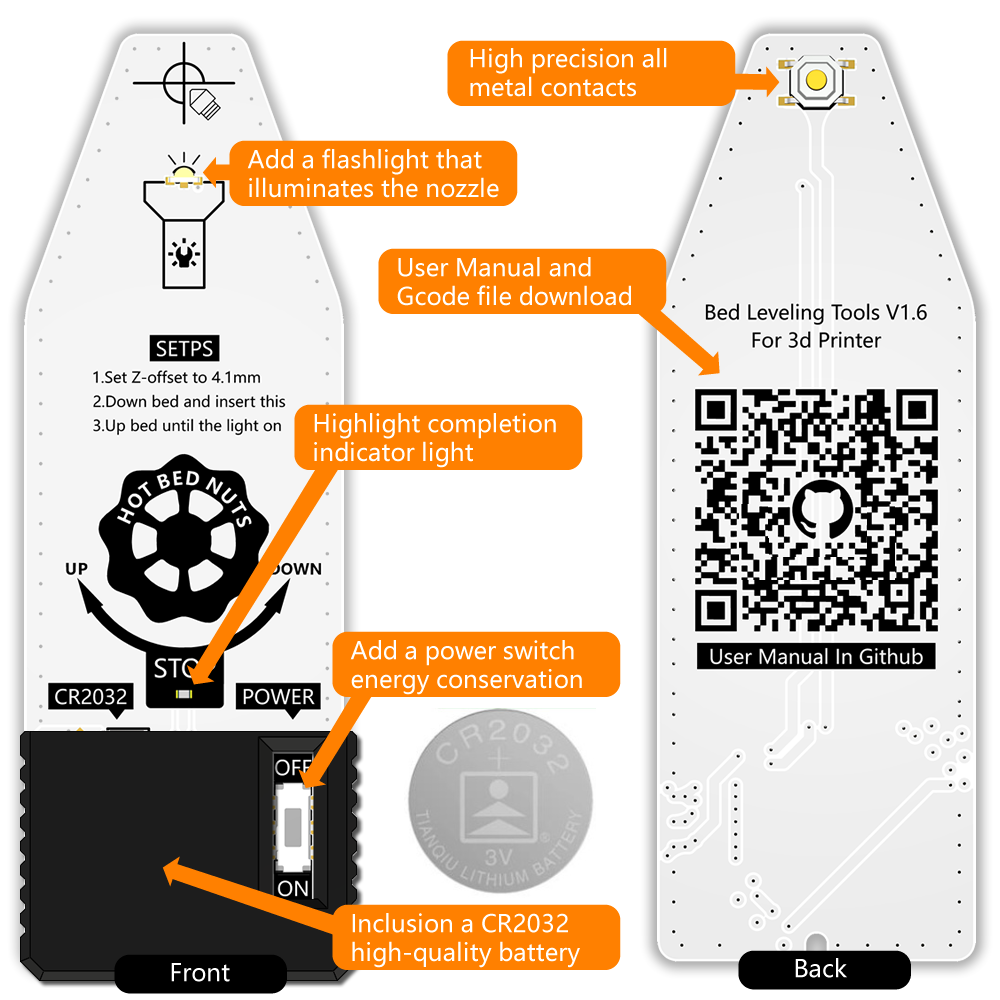

# HotBedLevelingTools

## Features

1. Widely used, this product is suitable for all heated beds with adjustable nuts. As well as all 3D printing platforms, such as PEI/magnetic/glass bed, etc.                      
2. More accurate: Compared with the traditional 3D printer leveling tool or A4 paper leveling, this product is more accurate, simple to operate, save time, and generally complete the accurate leveling in 3 minutes after executing 2 Gcode files, which is a very efficient 3D printer accessory.                    
3. More functions: Compared with similar electronic leveling tools, this product has added a power switch and a nozzle lighting light, the switch is simpler, and it is easier to align the nozzle position when leveling.
4. Open the package and use: The product comes with a CR2032 high-quality battery, open the package, open the switch and use.             
5. Open source code: The code is open source on Github, and the execution of Gcode code can quickly clean the nozzle, and can quickly adjust the position of the Z axis, and quickly assist in leveling. and provide print test models and slice files.

## BuyLink

Amazon 

## Instruction manual

### Step1:Copy Gcode file to printer

Download file from release file  Download,Copy these 3 files to the printer

1.MoveZAndHot.gcode

2.MoveZTo4.1mm.gcode

3.FirstLevelPrintTest-200X200.gcode

FirstLevelPrintTest.gcode is suitable for printers with a bed width greater than 200mm and General PLA material. Smaller printers or different materials can be re-sliced using the FirstLevelTest.STL file.

### Step2:Cleaning nozzle

Print 1.MoveZAndHot.gcode file,printer will move z axis to 100mm,then Set the sprinkler temperature to 200 degrees Celsius.When the printer shows that the printing is completed, it means that the printhead has reached 200 degrees Celsius, and then you can use tweezers to clean the printhead to prevent the residual material on the printhead from affecting the leveling accuracy.

### Step3:Start bed leveling

Print 2.MoveZTo4.1mm.gcode file, the printer will move the Z-axis to a height of 4.1 mm, adjust the leveling knob of the heat bed, and move it down as much as possible. Then insert this leveling tool. Adjust the knob with your left hand and hold it steady with your right hand. With the aid of the nozzle illuminator, align the nozzle with the cross mark of the leveling tool.

Adjust the leveling knob of the heat bed so that the heat bed moves up until the STOP indicator of the leveling tool lights up.

Leveling is carried out at the 4 corners of the hot bed according to the above method in turn. It is usually necessary to repeat this leveling twice to achieve the desired result

### Step4:Print Test

Print 3.FirstLevelPrintTest-200X200.gcode file,If the printed part has no holes in the bottom, it proves that the leveling has been successfully completed,if not, please follow the steps to start from scratch